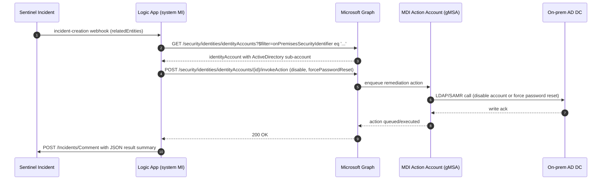

# MDI Disable + Force Password Reset Playbook

A Sentinel-triggered Logic App that disables an on-prem Active Directory account and/or forces a password reset by calling Microsoft Defender for Identity (MDI) remediation actions through Microsoft Graph. The Logic App uses a system-assigned managed identity for both the Graph call and the Sentinel incident comment — no secrets land in source or in app settings. The actual write to AD happens server-side, executed by the MDI gMSA Action Account on a sensor in the target domain.

## What this playbook does

When a Sentinel incident is created with an `Account` entity carrying either an on-prem `Sid` or an `AadUserId`, the playbook locates the MDI `identityAccount` for that user, picks its `ActiveDirectory` sub-account, and POSTs `disable` and/or `forcePasswordReset` to `security/identities/identityAccounts/{id}/invokeAction`. Results are appended back to the incident as a comment.



Reference docs used to design this:
- [MDI remediation actions](https://learn.microsoft.com/defender-for-identity/remediation-actions)
- [MDI gMSA Action Account requirements](https://learn.microsoft.com/defender-for-identity/manage-action-accounts)
- [identityAccount: invokeAction (beta)](https://learn.microsoft.com/graph/api/security-identityaccount-invokeaction?view=graph-rest-beta)
- [List identityAccounts](https://learn.microsoft.com/graph/api/security-identitycontainer-list-identityaccounts?view=graph-rest-beta)
- [Authenticate playbooks to Sentinel](https://learn.microsoft.com/azure/sentinel/authenticate-playbook-to-sentinel)

## Deploy to Azure (one-click)

[](https://portal.azure.com/#create/Microsoft.Template/uri/https%3A%2F%2Fraw.githubusercontent.com%2FLockbase-Cyber%2FSentinel-Playbooks%2Fmain%2Fmdi-disable-playbook%2Finfra%2Fmain.json/createUIDefinitionUri/https%3A%2F%2Fraw.githubusercontent.com%2FLockbase-Cyber%2FSentinel-Playbooks%2Fmain%2Fmdi-disable-playbook%2Finfra%2FcreateUiDefinition.json)

> **Note**: the badge above points at `Lockbase-Cyber/Sentinel-Playbooks` on the `main` branch. If you fork to a different org, edit BOTH `uri` (template) and `createUIDefinitionUri` (form definition) accordingly.

The Azure portal renders a guided form from [`infra/createUiDefinition.json`](infra/createUiDefinition.json):

- **Basics page**: subscription, resource group, region, and a **Sentinel workspace picker** (the only required custom input — pick the Log Analytics workspace Sentinel is onboarded to).
- **Playbook settings page** (everything has sensible defaults):
  - **Logic App name** — leave blank to auto-generate (`pa-mdi-disable-<8-char-hash>`).
  - **Actions to enable** — multi-select; both `disable` and `forcePasswordReset` enabled by default.
  - **Advanced section**: Graph permission grant strategy. Defaults to "Post-deploy script (recommended)" — no bootstrap MI required. Switch to `deploymentScripts` only if you have already provisioned a bootstrap user-assigned MI per the [Advanced section](#advanced-fully-automated-graph-grant-via-deploymentscripts) below; the form will then show a UAMI picker.

If you prefer the raw Custom Deployment form (no createUiDefinition guidance), use this URL instead — every ARM parameter is exposed without grouping or pickers:

```
https://portal.azure.com/#create/Microsoft.Template/uri/https%3A%2F%2Fraw.githubusercontent.com%2FLockbase-Cyber%2FSentinel-Playbooks%2Fmain%2Fmdi-disable-playbook%2Finfra%2Fmain.json
```

## Prerequisites checklist

Sentinel-side:
- [ ] A Sentinel-enabled Log Analytics workspace in the target tenant.
- [ ] You have the workspace ARM resource ID handy (`/subscriptions/.../resourceGroups/.../providers/Microsoft.OperationalInsights/workspaces/...`).

MDI-side:
- [ ] MDI is deployed and sensors are installed on at least one Domain Controller covering the accounts you want to remediate.
- [ ] An MDI Action Account is configured — a domain gMSA with the rights documented at [Manage action accounts](https://learn.microsoft.com/defender-for-identity/manage-action-accounts). 200 OK from Graph does not imply AD success without this.
- [ ] You have a tenant role permitting URBAC assignment in the Defender XDR portal (Security Administrator or higher).

Azure-side:
- [ ] Permission to deploy resources to the target resource group (`Contributor` or equivalent).
- [ ] Permission to assign roles at the resource-group scope (`Owner` or `User Access Administrator`) — used by `roleAssignments.bicep` to grant the Logic App MI the Sentinel Responder role.

Graph-side:
- [ ] A Privileged Role Administrator or Global Administrator who can grant the two Graph app permissions to the new managed identity post-deploy.
- [ ] *(Advanced path only)* A pre-provisioned bootstrap user-assigned managed identity with `AppRoleAssignment.ReadWrite.All` on Microsoft Graph. See [docs/permissions.md](./docs/permissions.md#bootstrap-uami).

## Post-deploy: grant the two Graph app permissions to the Logic App MI

This is the headline post-step. The Bicep deployment creates the Logic App and its system-assigned MI but cannot grant Graph app roles to itself in the default (no-deploymentScript) path. Do it once, in one of two ways.

### Step 1 — Get the Logic App's managed identity principal ID

From the deployment outputs (portal Deployments blade, or the CLI):

```bash
az deployment group show -g <RG> -n <DEPLOYMENT-NAME> \
  --query properties.outputs.managedIdentityPrincipalId.value -o tsv
```

### Step 2 — Grant the Graph app permissions

In Azure Cloud Shell (bash), signed in as a Privileged Role Administrator or Global Admin:

```bash
curl -sSL https://raw.githubusercontent.com/Lockbase-Cyber/Sentinel-Playbooks/main/mdi-disable-playbook/scripts/grant-graph-permissions.sh \
  -o grant-graph-permissions.sh && chmod +x grant-graph-permissions.sh
./grant-graph-permissions.sh <MI_PRINCIPAL_ID>
```

Or locally in PowerShell 7+:

```powershell
Install-Module Microsoft.Graph -Scope CurrentUser
./scripts/grant-graph-permissions.ps1 -LogicAppPrincipalId <MI_PRINCIPAL_ID>
```

The two roles granted are `SecurityIdentitiesAccount.Read.All` (read) and `SecurityIdentitiesUserActions.ReadWrite.All` (invoke). See [docs/permissions.md](./docs/permissions.md) for verification.

## Post-deploy: assign the Logic App MI an MDI URBAC role

The Graph app permission alone is insufficient — the MI also needs URBAC inside Defender XDR to be allowed to invoke remediation actions on identities.

1. Defender portal → **Settings** → **Microsoft Defender XDR** → **Permissions and roles** → **Roles**.
2. **Create or reuse a role** that includes the **Response (manage)** permission group on the **Identities** data source.
3. Scope to **all identities** or to the targeted scope your environment requires.
4. **Add the Logic App MI** (by its `managedIdentityPrincipalId`) as a member.

Detailed walkthrough and a screenshot placeholder are in [docs/permissions.md](./docs/permissions.md#mdi-urbac-role-assignment).

## Post-deploy: wire it to incidents

The deployment registers the Logic App with Sentinel but does **not** subscribe it to incidents. Do that once, per workspace, in the portal:

1. Sentinel → **Configuration** → **Automation** → **Create new automation rule**.
2. **Trigger**: `When incident is created`.
3. **Conditions**: at minimum, scope by the analytics rule(s) you trust to fire high-confidence detections that produce an `Account` entity. Auto-disable on a low-confidence detection will burn you.
4. **Action**: `Run playbook` → select the Logic App created by this deployment.

## GitHub Actions deploy (IaC-driven path)

For repeatable deployments (recommended once you've validated in-portal):

1. **Fork** the repo.
2. Configure the target subscription's Entra app for OIDC. Set the federated credentials for `repo:<owner>/<repo>:ref:refs/heads/main` and `repo:<owner>/<repo>:pull_request`.
3. Set GitHub Actions **repository variables** (not secrets — the whole point of OIDC):
   - `AZURE_CLIENT_ID`
   - `AZURE_TENANT_ID`
   - `AZURE_SUBSCRIPTION_ID`
   - `RESOURCE_GROUP_NAME`
4. Edit `infra/parameters/dev.parameters.json` and `infra/parameters/prod.parameters.json` to replace each `REPLACE_ME` marker — including `bootstrapManagedIdentityResourceId` if you've set `grantGraphPermissionsViaDeploymentScript = true`.
5. Push to `main`. The `Deploy` workflow runs and prints `State: Enabled` plus the MI principal ID on success.

PR validation (`.github/workflows/validate.yml`) runs on every PR: Bicep build with warnings-as-errors, drift check between `main.bicep` and the committed `main.json`, arm-ttk, and JSON schema validation on `workflow.json`.

## Manual deploy via Azure CLI

If you don't want GitHub Actions in the loop:

```powershell
az bicep build --file mdi-disable-playbook/infra/main.bicep --outdir mdi-disable-playbook/infra
az deployment group create `
  -g <RG> `
  --template-file mdi-disable-playbook/infra/main.json `
  --parameters @mdi-disable-playbook/infra/parameters/dev.parameters.json
```

Followed by the two post-deploy steps above (Graph permissions, MDI URBAC role, Automation Rule).

## Advanced: fully automated Graph grant via `deploymentScripts`

If you'd rather not run the bash/pwsh grant step manually after every deploy, the Bicep supports an opt-in `deploymentScripts` path that runs inline PowerShell to grant the two Graph app roles to the Logic App MI as part of the deployment itself.

Requirements:
- A pre-provisioned **bootstrap user-assigned managed identity** in the subscription with `AppRoleAssignment.ReadWrite.All` on Microsoft Graph. This is a one-time, per-subscription setup. Instructions in [docs/permissions.md](./docs/permissions.md#bootstrap-uami).
- Set `grantGraphPermissionsViaDeploymentScript = true`.
- Supply `bootstrapManagedIdentityResourceId` (the full ARM ID of the bootstrap UAMI).

When enabled, the post-deploy "grant the two Graph app permissions" step above is skipped — the `deploymentScripts` resource handles it.

## How to test

See [docs/testing.md](./docs/testing.md) for the pre-deploy gates (Bicep build clean, arm-ttk, what-if), the post-deploy smoke test (`scripts/test-invoke.ps1` against a known test SID), and the two E2E paths (Defender portal "Run playbook" and `az rest` against the Sentinel `Incidents - Create` API).

## Known limitations

- **Beta API.** `security/identities/identityAccounts` is on `/beta` at the time of writing. Risk mitigation: the workflow's `graphBaseUrl` is a single pinned parameter — change it in one place to cut over to v1.0 when the endpoint goes GA.
- **AAD-only fallback is bounded.** The AAD branch fetches one page of `identityAccounts` (`$top=999`) and filters client-side because no server-side filter on the cloud `identifier` is documented today. Tenants larger than 999 `identityAccount` records that rely on the AAD path must extend the workflow to follow `@odata.nextLink`. Tracked as v2 work.
- **`PasswordNeverExpires` silently no-ops `forcePasswordReset` on AD.** MDI/AD will accept the call and the action will appear successful, but the user's next-logon password change will not be enforced. Workspace operators must catch this in their account-hygiene checks.
- **gMSA delegation scope is the AD-write gate.** A 200 OK from Graph means MDI accepted the request — it does **not** guarantee the gMSA Action Account had write privileges over the target user in AD. Polling Defender Action Center for terminal action status is v2 work.
- **No rollback action.** The playbook is one-way. Auto-execute against high-confidence detections only; for medium-confidence detections, the v2 design adds a Teams-approval gate before the `invokeAction` POST.

## Contributing

- **PR validation** (`.github/workflows/validate.yml`) runs on every pull request:
  - `az bicep build` with warnings-as-errors.
  - Drift check between `infra/main.bicep` and the committed `infra/main.json`.
  - arm-ttk.
  - JSON schema validation on `infra/workflow/workflow.json` via `infra/workflow/schema-validate.ps1`.
- **Before committing Bicep changes**, always run:
  ```powershell
  az bicep build --file mdi-disable-playbook/infra/main.bicep --outdir mdi-disable-playbook/infra
  ```
  and stage the regenerated `main.json` alongside the Bicep delta. PRs that fail the drift check will not merge.
- **Conventional commits** (`feat:`, `fix:`, `docs:`, `chore:`, etc.) — used by the squash-merge changelog flow.
- **No secrets in source.** The whole design is managed-identity-first. If you find yourself reaching for an app registration with a client secret, stop and re-read [docs/permissions.md](./docs/permissions.md).
