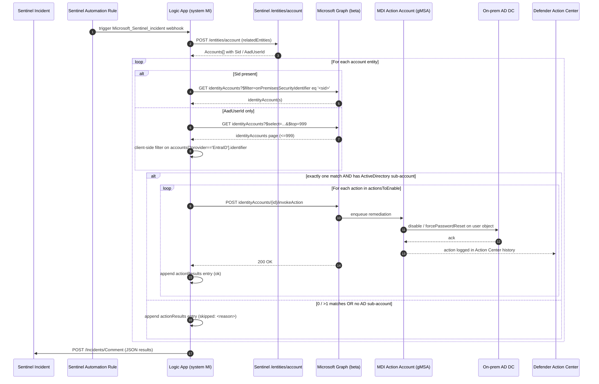

# Architecture

This document covers the runtime data flow, the workflow action graph in `infra/workflow/workflow.json`, the design decisions that aren't visible from reading the JSON, and the engineering workarounds applied during Bicep authoring.

## Sequence diagram



## Workflow walkthrough

Action names below are exact identifiers from `infra/workflow/workflow.json` — keep them in sync.

1. **`Initialize_actionResults`** and **`Initialize_matchesScratch`** seed two array variables. `actionResults` is what gets serialized into the incident comment; `matchesScratch` is the per-entity buffer that the Switch on match strategy writes to.
2. **`Entities_-_Get_Accounts`** calls the Sentinel connector's `/entities/account` endpoint with `triggerBody().object.properties.relatedEntities`. This is the Sentinel-2024+ schema path (see [Schema assumption](#sentinel-incident-schema-assumption)).
3. **`For_each_account`** iterates over `body('Entities_-_Get_Accounts').Accounts`.
4. **`Compose_sid`** and **`Compose_aadUserId`** coalesce the entity's `Sid` and `AadUserId` to empty strings. **`Check_identifier_present`** branches: if both are empty, append `skipped: no usable identifier` and move on.
5. **`Switch_match_strategy`** picks the lookup strategy based on which identifier is present:
   - **`BySid`** (preferred): **`List_identityAccounts_by_sid`** issues a server-side `$filter=onPremisesSecurityIdentifier eq '<sid>'` against the pinned `graphBaseUrl`. **`Set_matches_from_sid`** captures the response.
   - **`ByAad`** (fallback): **`List_identityAccounts_unfiltered`** does a bounded GET (`$top=999`, no filter), **`Filter_aad_subaccount_match`** runs a `Query` action client-side keeping entries where any sub-account has `provider == 'EntraID'` and `identifier == @outputs('Compose_aadUserId')`, and **`Set_matches_from_aad`** captures the filtered list. See [AAD fallback tradeoff](#aad-fallback-tradeoff).
6. **`Filter_matches`** composes the final candidate set from `matchesScratch`. **`Switch_on_match_count`** dispatches on `length(...)`:
   - **`ExactlyOne`** (case `1`): **`Compose_identityAccountId`** grabs `[0].id`, **`Filter_AD_subaccount`** picks the `ActiveDirectory` sub-account from the `accounts` array. If present, **`For_each_action`** iterates `parameters('actionsToEnable')` and POSTs **`Invoke_action`** to `{graphBaseUrl}/{id}/invokeAction` with body `{ accountId, action, identityProvider: 'activeDirectory' }`. **`Append_action_result`** and **`Append_action_failure`** wire success/fail branches into `actionResults`. If no AD sub-account, **`Append_no_AD_subaccount`** records a skip.
   - **`NoMatch`** (case `0`): **`Append_no_match`** records `skipped: MDI has not observed this identity`.
   - **`default`** (>1 match): **`Append_ambiguous`** records the match count and refuses to act. Disambiguation belongs upstream (better analytic), not inside the playbook.
7. **`Compose_comment_markdown`** wraps `actionResults` in a fenced JSON block. **`Add_comment_to_incident`** POSTs it to `/Incidents/Comment` for the incident ARM ID from the trigger payload.

Retry policy on the two `Http` actions (`List_identityAccounts_*` and `Invoke_action`): exponential, 3 tries, 30s base, 10s minimum / 2m maximum interval — tuned for transient Graph 429/503s.

## Why the Microsoft Graph connector was NOT used

The native Logic Apps "Microsoft Graph" connector has historical lag tracking beta surface. `security/identities/identityAccounts` and its `invokeAction` operation are on `/beta`; the connector's typed operations either omit them or wrap them in a way that obscures the `identityProvider`/`accountId` request body. Using raw `Http` actions with `ManagedServiceIdentity` authentication and a pinned `graphBaseUrl`:

- Lets us swap `beta` → `v1.0` in one place at GA time.
- Gives us full control over `$filter`, `$select`, and `$top` — critical for the SID-first lookup path.
- Avoids the connector's lifecycle: no `Microsoft.Web/connections` resource for Graph, only the one for `azuresentinel` (which is still the right call there because we need the Sentinel-native auth and entity-resolution semantics).

**Don't "fix" this** by switching to the typed connector. It's a deliberate choice and reverting it will break the cutover contract below.

## AAD fallback tradeoff

The workflow only acts on `Sid`-bearing account entities **except** in the explicit ByAad fallback path, and the fallback is intentionally bounded:

- **Today**: when only `AadUserId` is present, we fetch one page (`$top=999`) of `identityAccounts` and filter client-side on `accounts[?provider=='EntraID'].identifier`. Tenants with more than 999 identityAccounts that rely on the AAD path will silently miss matches.
- **Rejected alternative**: paginate `@odata.nextLink` on every AAD-only incident. Reasons it was rejected for v1:
  - **(a)** Page-fetching the entire `identityAccounts` collection on every incident is expensive in latency and Graph quota.
  - **(b)** MDI's coverage of pure-cloud identities is partial anyway — an AAD-only entity that doesn't correspond to a hybrid user will never match, no matter how many pages you walk.
  - **(c)** Entra-only block-out (revoke sessions, disable in Entra) is fundamentally a different control plane and is better handled by a sibling playbook against `/users/{id}/revokeSignInSessions` and the Entra disable API.
- **Future v2**: pagination plus a short-TTL cache of `identityAccounts` keyed on tenantId would close the bounded-page gap without making every incident hop the full collection.

Document this as a conscious gap, not an oversight. If a reviewer files a "missing pagination" bug, point them here.

## Pinned `graphBaseUrl`: the single-point cutover contract

`workflow.json` parameter:

```json
"graphBaseUrl": {
  "type": "String",
  "defaultValue": "https://graph.microsoft.com/beta/security/identities/identityAccounts"
}
```

Every Graph call in the workflow concatenates against this parameter:
- `List_identityAccounts_by_sid` uses `@{parameters('graphBaseUrl')}` directly.
- `List_identityAccounts_unfiltered` uses `@{parameters('graphBaseUrl')}` directly.
- `Invoke_action` uses `@{concat(parameters('graphBaseUrl'), '/', outputs('Compose_identityAccountId'), '/invokeAction')}`.

When the endpoint reaches GA, the cutover is exactly one parameter change. There must be no other hard-coded references to `graph.microsoft.com/beta/security/identities/identityAccounts` anywhere in the workflow.

## Sentinel incident schema assumption

The trigger and the `Entities_-_Get_Accounts` action assume the 2024+ Sentinel incident-creation payload shape, where related entities live at:

```
triggerBody().object.properties.relatedEntities
```

and the comment endpoint takes `incidentArmId = triggerBody().object.id`. Pre-2024 workspaces using the legacy schema would need `triggerBody().Entities` and `triggerBody().IncidentArmID` instead — not supported by v1 of this playbook.

## PII handling

The workflow never logs full SIDs at INFO level. Specifically:
- `Compose_sid` and `Compose_aadUserId` are visible in the Logic App run trace but only in the per-run history that already requires read access to the resource group — same trust boundary as the resource group itself.
- `actionResults` (which is committed to the Sentinel incident comment) contains the `identityAccountId` (an MDI-internal GUID) and an action verb — not the raw SID or AAD object id.

If you add diagnostic settings or a custom log sink, do **not** lift `outputs('Compose_sid')` into a separate Compose action whose name reads like a logging line. The current shape is intentional.

## Engineering notes

### No `accessPolicies` child on the Sentinel API connection

`Microsoft.Web/connections/accessPolicies` is only supported on **V2** API connections. Our `kind: 'V1'` connection (which is what every published Microsoft Sentinel playbook uses, including Azure/Azure-Sentinel and Azure/Microsoft-Defender-for-Cloud samples) rejects an `accessPolicies` child at deploy time with `InvalidApiConnectionAccessPolicy`. We do not need one.

The Logic App's managed identity is authorized to use the connection via two cooperating settings, both already in place:
- The connection itself sets `properties.parameterValueType: 'Alternative'` (with empty `customParameterValues`), which tells the connector "this connection uses managed-identity auth, not OAuth".
- The Logic App's `parameters.$connections.value.azuresentinel.connectionProperties.authentication.type = 'ManagedServiceIdentity'` tells the runtime to authenticate as the Logic App's system-assigned MI when invoking the connection.

The combination is exactly what the canonical Microsoft Sentinel playbooks (RecordedFuture-Alert-Importer, AttackPath-Sentinel-Incident-Enrich, etc.) ship in production. An access-policy resource was tried during initial implementation and rejected by the platform.

### `apiVersion: 2016-06-01` on `Microsoft.Web/connections`

The stable `2016-06-01` API version is the one Microsoft's own production Sentinel templates use. The `2018-07-01-preview` version revalidates `parameterValueType: 'Alternative'` differently and rejects connections that the stable version accepts. Bicep's type metadata for `2016-06-01` predates `kind` and `parameterValueType` on this resource, so build emits BCP037/BCP187 warnings — suppressed inline because the runtime accepts these properties as the official samples prove.

### `forceUpdateTag: utcNow()` as a parameter default

`Microsoft.Resources/deploymentScripts.properties.forceUpdateTag` is set inline to `utcNow()` to force a re-run on every deploy. The Bicep compiler emits **BCP065** (`Function "utcNow" is not valid at this location. It can only be used as a parameter default value.`) if used directly. `graphPermissions.bicep` declares it as a parameter:

```bicep
param forceUpdateTag string = utcNow()
```

and the resource property references the parameter. Behavior is identical (each deployment recomputes the default at template-evaluation time, forcing a re-run); the compile is clean.
